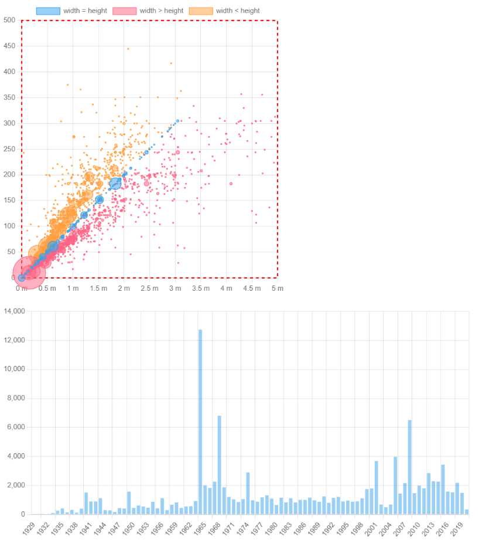

# KARYOSIM
## KARYOTYPE SIMULATED using chartjs

## URL https://www.chartjs.org/docs/master/getting-started/usage.html
## Steps:
1. Modern front-end applications often use JavaScript module bundlers, 
1. so we’ve picked Parcel as a nice zero-configuration build tool. 
1. We’re also installing Chart.js v4 and a 
1. JavaScript client for Cube , an open-source API for data apps we’ll use to fetch real-world data.
1. Edit package.json file with parcel, cube and chart.js dependencies
1. Run npm install, yarn install, or pnpm install to install the dependencies, 
1. then create the src folder. Inside that folder, we’ll need a very simple index.html file.
1. create src/app.js
1. Customize Chart.js charts. 
    1. turn off the animations so the chart appears instantly. 
    1. hide the legend and tooltips since we have only one dataset.
1. Another—and very powerful!—way to customize Chart.js charts is to use plugins. You can find some in the 
1. plugin directory or create your own, ad-hoc ones. In Chart.js ecosystem, it’s idiomatic and expected to fine tune charts with plugins. 
1. For example, you can customize canvas background or add a border to it with simple ad-hoc plugins. 

# Pie and doughnut are good but for fewer items.

# Bubble graph would allow many more items

karyosim\public\Screenshot 2023-06-17 154745.png

